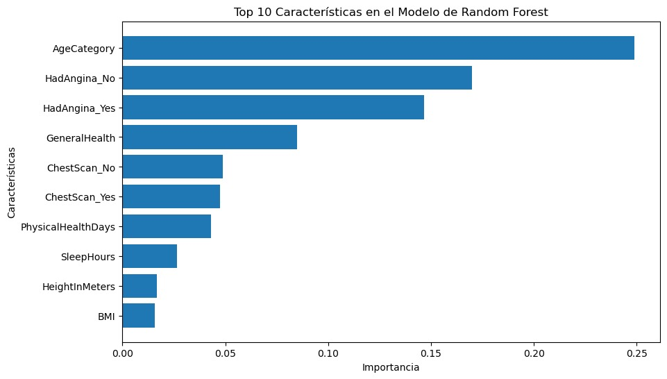

# ❤️ Heart Attack Risk Prediction: Model Optimization

  

## 📋 Overview
This project focuses on predicting the risk of heart attacks using a dataset of **2022 health indicators**. The core engineering challenge was not just to build a predictive model, but to **optimize it** by identifying the most critical risk factors effectively reducing the computational input without sacrificing diagnostic accuracy.

We implemented two approaches:
1.  **Baseline Model:** Utilizing the full spectrum of clinical attributes.
2.  **Optimized Model:** Reducing the dimensionality to the top key indicators based on Feature Importance analysis.

## ⚙️ Key Technologies
* **Algorithm:** Random Forest Classifier.
* **Techniques:** SMOTE (Synthetic Minority Over-sampling Technique) for handling class imbalance.
* **Optimization:** Feature Selection based on Gini Importance.

## 📊 Engineering Insights

### 1. What drives the prediction? (Feature Importance)
Through the Random Forest analysis in `01_Full_Model`, we identified that lifestyle factors (BMI, Smoking) and Age are significant predictors, allowing us to filter out noise from less relevant variables.



### 2. Optimization Results (Full vs. Reduced)
By removing low-impact variables in `02_Optimized_Feature_Selection`, we simplified the model input.

| Model Version | Features Count | Accuracy | Recall (Sensitivity) |
| :--- | :---: | :---: | :---: |
| **Full Model** | All | 85.5% | 1.00% |
| **Optimized** | Reduced | 87.0% | 1.00% |

> **Medical Note:** We prioritized **Recall** (Sensitivity) to minimize False Negatives. In cardiac diagnostics, missing a positive case (False Negative) is the most critical error.

### Confusion Matrix (Optimized Model)


## 🚀 Usage
1.  Clone the repository:
    ```bash
    git clone https://github.com/JoseMiguelB/Heart-Attack-Risk-Prediction.git
    ```
2.  Install dependencies:
    ```bash
    pip install pandas scikit-learn seaborn matplotlib
    ```
3.  Run the notebooks:
    * Start with `notebooks/01_Full_Model...` for the complete analysis.
    * Check `notebooks/02_Optimized...` for the refined model.

## 📂 Dataset
The full dataset (~78MB) is sourced from the **CDC (2022)**. Due to GitHub size limits, it is available externally:
👉 **[Download Dataset from Kaggle](https://www.kaggle.com/datasets/josembm/heart-attack-risk-prediction)**

*A `sample_heart_data.csv` is provided in the `data/` folder for code testing purposes.*

## 🚀 Installation
1. Clone the repo:
   ```bash
   git clone https://github.com/JoseMiguelB/Heart-Attack-Risk-Prediction.git
